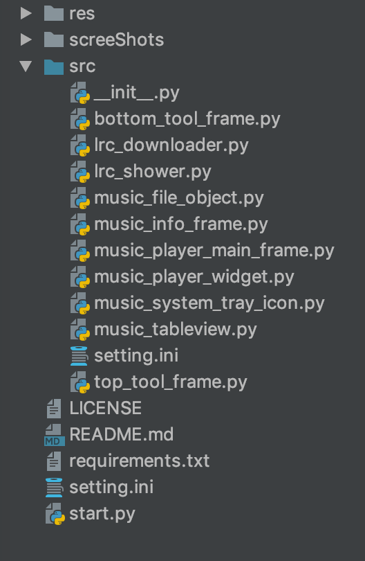
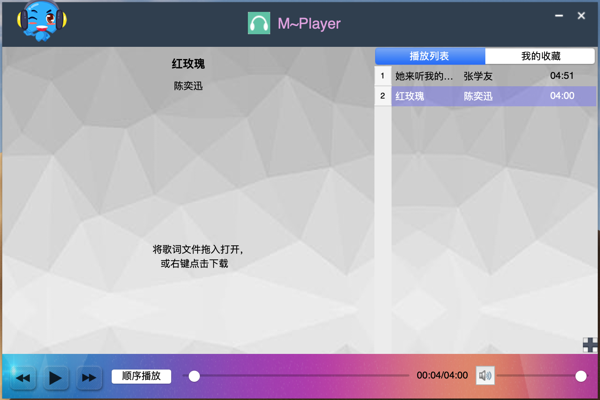
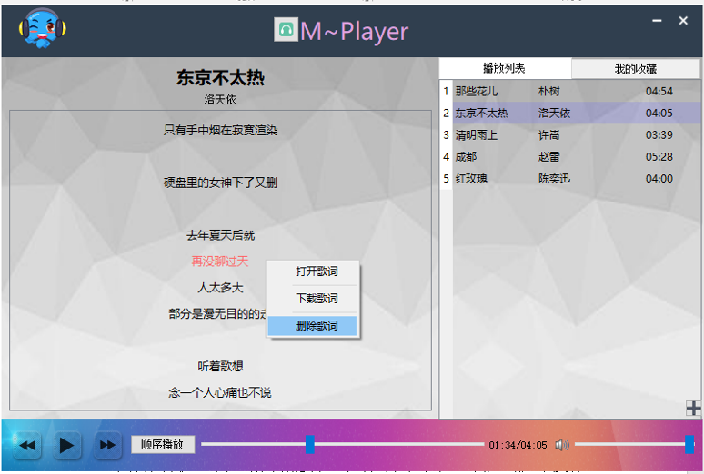

# MusicPlayer

## A simple music player implements with PyQt4.
---
## Author: [Zhijun Xue](https://github.com/wonderfulxue)
---
## Features
- [x] 基本播放功能: 播放▶️，暂停⏸，快进⏩，快退⏪，停止⏹
- [x] 支持播放模式: 单曲播放；单曲循环；顺序播放；随机播放
- [x] 支持播放信息展示: 歌曲名，播放时间，歌手信息
- [x] 支持播放列表管理: 本地歌曲批量添加，拖拽歌曲添加，歌曲播放列表删除，播放次序调整
- [x] 支持歌词显示
- [x] 良好的播放界面  
- [x] 自动记忆播放功能（程序关闭时能记忆当前播放的曲目）
- [x] 支持不同风格的音乐模式播放

---

## Requirements
> - Python 2.7
> - PyQt4
> - chardet
> - mutagen
> - enum

### Setup environments
 > pip install -r requirements.txt

## Show Case:

### Project strcture:

### GUI:

 

